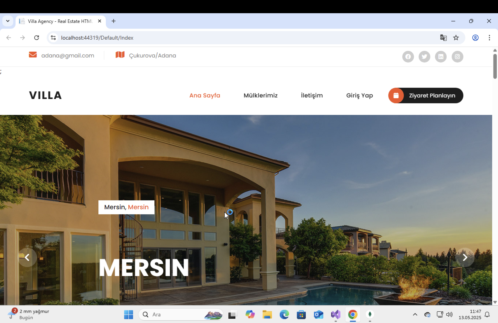
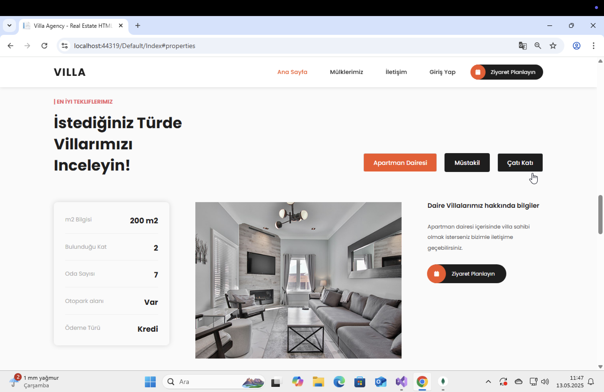

🏡 Real Estate Web Application

Bu proje, emlak satış, kiralama ve ev inceleme işlemlerini kolaylaştırmak için geliştirilmiş bir web uygulamasıdır. Kullanıcılar, istedikleri özelliklere sahip evleri arayabilir, detaylarını görüntüleyebilir ve ilanları yönetebilirler.

🚀 Özellikler

📋 Emlak satış ve kiralama ilanları oluşturma

🔍 Detaylı arama ve filtreleme özellikleri

🏠 Ev detay sayfaları (fotoğraf, açıklama, fiyat vb.)

👤 Kullanıcı giriş/çıkış ve kayıt işlemleri

📊 Yönetici paneli ile ilanları yönetme

🛠️ Kullanılan Teknolojiler

Backend: C#, ASP.NET Core

ORM: Entity Framework

Veritabanı: MongoDB

Frontend: HTML, CSS, JavaScript

Diğer: LINQ, RESTful API

⚙️ Kurulum

Projeyi Klonlayın:

git clone https://github.com/kullaniciadi/real-estate-app.git

Bağımlılıkları Yükleyin:

dotnet restore

Veritabanı Bağlantısını Yapılandırın:appsettings.json dosyasında MongoDB bağlantı ayarlarını düzenleyin:

{
  "ConnectionStrings": {
    "MongoDb": "mongodb://localhost:27017/realestate"
  }
}

Projeyi Başlatın:

dotnet run

🚩 Kullanım

Kayıt Ol: Hesap oluşturun.

Evleri İncele: Fiyat, konum ve diğer kriterlere göre filtreleyin.

İlan Ekle: Satılık veya kiralık ev ilanınızı oluşturun.

🤝 Katkıda Bulunma

Katkıda bulunmak isterseniz, lütfen bir fork oluşturun, değişikliklerinizi yapın ve bir pull request gönderin.

## Ekran Görüntüleri

> Projeye ait tüm ekran görüntüleri `screenshots` klasöründe bulunmaktadır.

📜 Lisans

Bu proje MIT Lisansı ile lisanslanmıştır.

Herhangi bir sorunuz varsa bana ulaşabilirsiniz! 🚀

